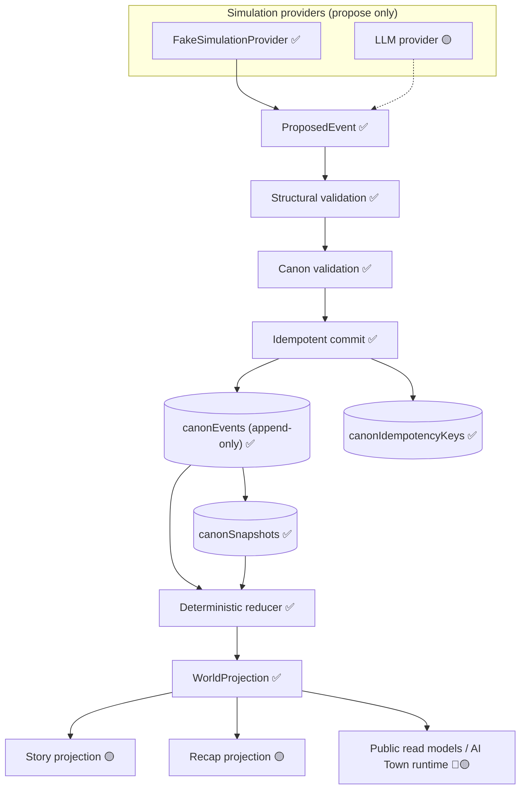

# Target State

The target architecture for AI Reality Town. Items are tagged:

- ✅ **Implemented in Phase 0**
- 🟡 **Planned after Phase 0**
- 🔵 **Upstream retained** (AI Town)
- 🆕 **New project-owned module**

## Layers

| Layer | Status | Notes |
| --- | --- | --- |
| AI Town visual & realtime runtime | 🔵 | Map, tick state, PixiJS client, engine. |
| Public read models (UI) | 🟡 | Future read projections for the audience. |
| Simulation workflow | ✅ 🆕 | `runFoundationSimulation` (fake provider). |
| World-day execution loop | ✅ 🆕 | `runQueuedWorldDaySlot` drives PRD §12 stages 1–10 (see `docs/world-day-execution.md`). |
| Simulation provider | ✅ 🆕 | `FakeSimulationProvider`, `FakeWholeSceneProvider`; LLM provider 🟡. |
| Proposed events | ✅ 🆕 | `ProposedEvent` + runtime validators. |
| Structural validation | ✅ 🆕 | `validateEventStructure`. |
| Canon validation | ✅ 🆕 | `validateCanon` (preconditions, participants, …). |
| Append-only event store | ✅ 🆕 | `canonEvents`, `canonIdempotencyKeys`. |
| Deterministic reducer | ✅ 🆕 | `reduceWorldEvent`. |
| Snapshots & replay | ✅ 🆕 | `canonSnapshots`, `replayWorldEvents`, `replayFromSnapshot`. |
| Story projection | 🟡 🆕 | Boundary declared (`convex/story/`); not implemented. |
| Recap projection | 🟡 🆕 | Boundary declared (`convex/recaps/`); not implemented. |
| Observability | ✅ 🆕 | Trace id plumbing (`convex/observability/`). |

## Data flow (Phase 0)

## Boundaries

- The versioned dependency policy and complete module ownership matrix live in
  [`module-boundaries.md`](module-boundaries.md) and are enforced by
  `npm run check:architecture`.
- **Simulation → Canon:** providers propose; only the commit pipeline writes canon.
- **Canon → Projections:** story/recap/UI are read models derived from canon; they never
  write canon.
- **Canon → AI Town:** a future director step (🟡) mirrors canonical facts into AI Town
  inputs for visualization. AI Town never writes canon.

## Foundation scope vs. PRD delivery

- **Phase 0 (✅):** canon model, validation, idempotent commit, deterministic reducer,
  replay, snapshots, fake provider, foundation workflow, tests, CI, docs.
- **PRD task graph (🟡):** real LLM provider, durable workflow, story/recap engines,
  audience UI, voting, and public operations. Backlog tasks are the delivery authority.
